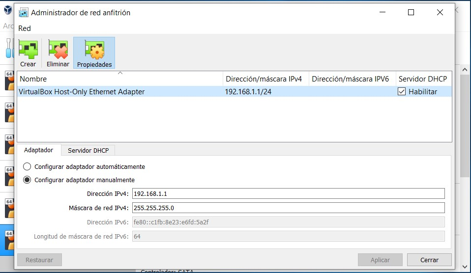
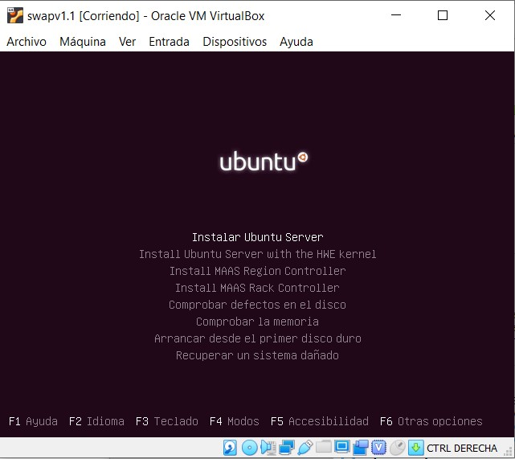
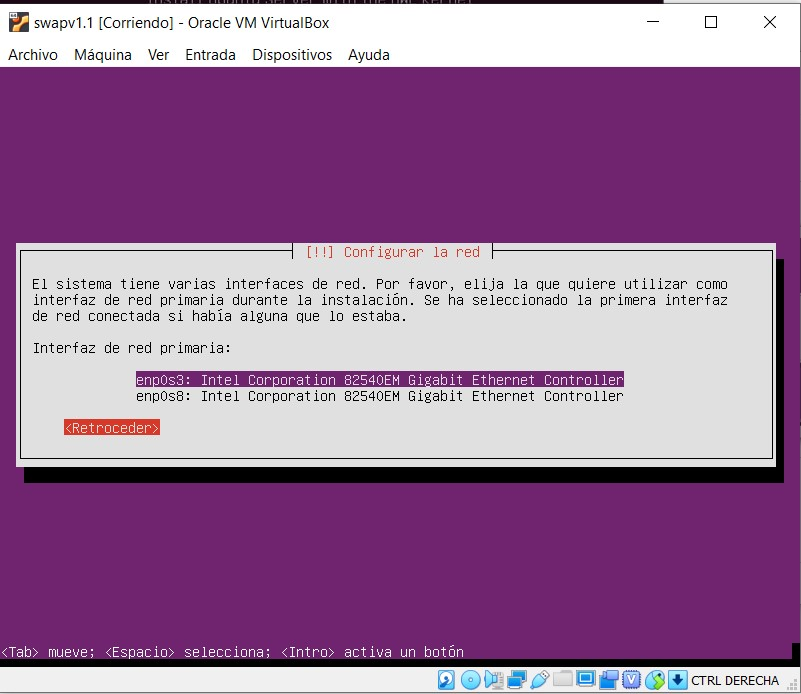
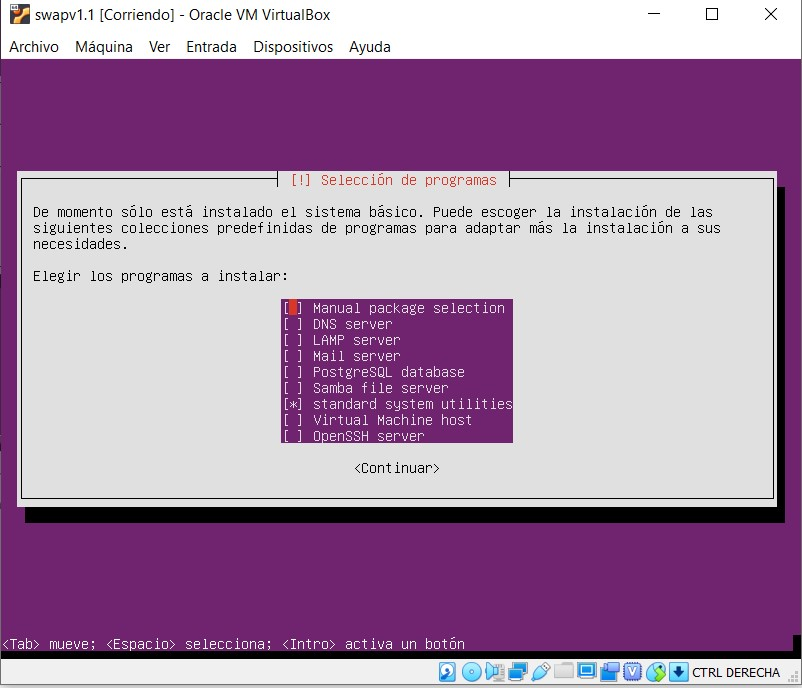
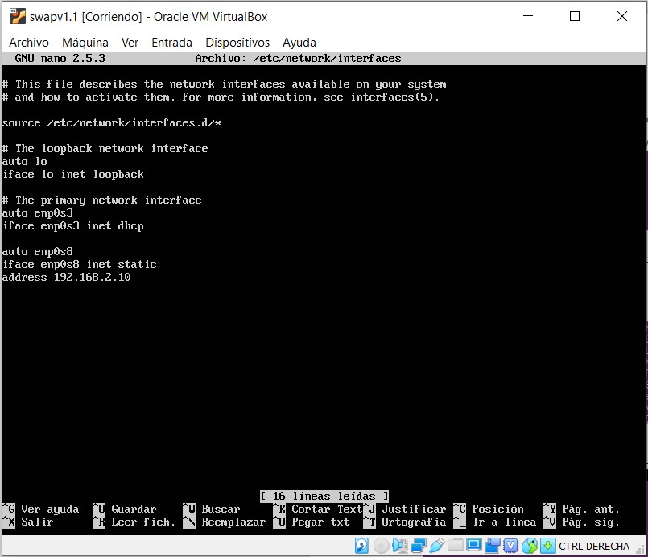
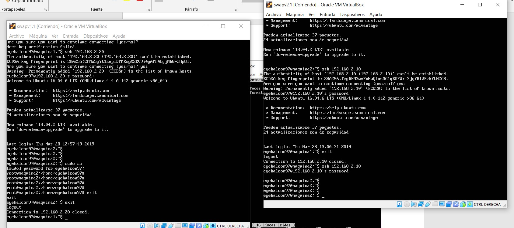

# swap1819
Practica 1:

Para empezar nos iremos a configuracion del la virtualbox -> administrador de redes Anfitrion
Alli crearemos una tarjeta de red virtual y la añadiremos a la maquina virtual antes de la instalacion para asi tener una configuracion de esta en la instalacion.

Comenzaremos con la instalacion de Ubuntu server 16.04

Al configurar la red antes de la instalacion, el sistema operativo reconoce ambas redes.

Durante la instalacion podemos seleccionar que nos instale el LAMP y ssh service.

Ahora una vez hecho esto nos vamos a /etc/network/interfaces y configuramos la segunda interfaz que es la que nos da conexion entre los dos servidores

Una vez asignado la ip haremos ifup enp0s8 y con ello se activara la red
Una vez hecho esto en ambos seridores y configurado su propia ip habremos conseguido que se hagan ping entre ellas y que se puedan conectar mediante ssh

