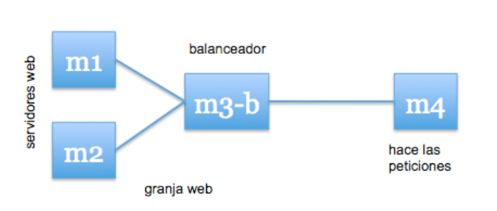
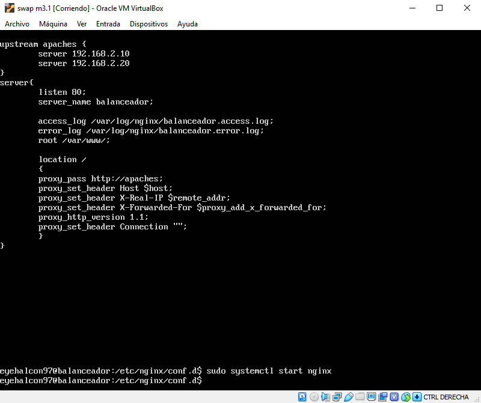
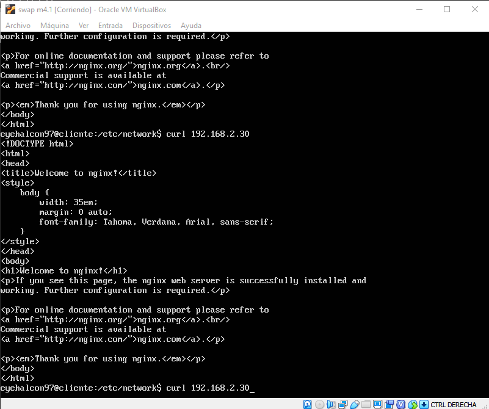
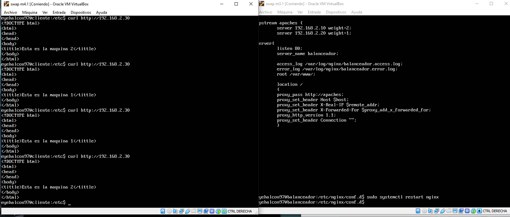
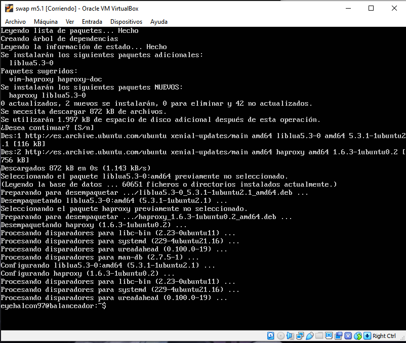
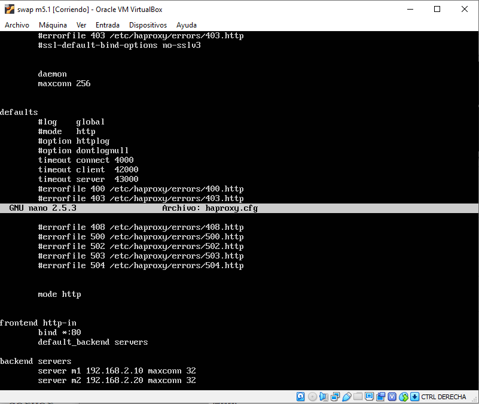
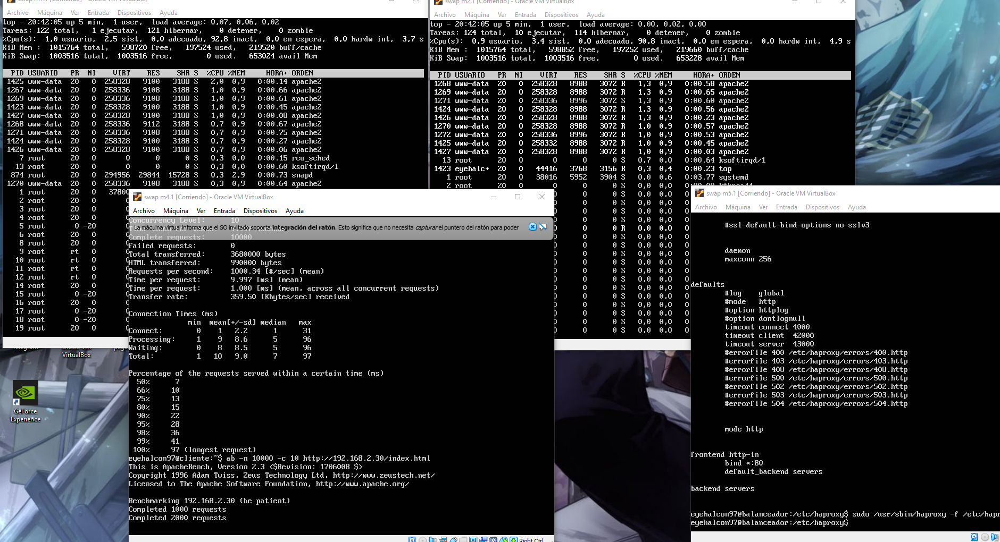

# swap1819
Practica 3:
En esta tercera practica vamos a configurar una tercera maquina virtual que hara de balanceador de carga:
Nuesta configuracion quedara tal que asi:

Vamos a crear dos nuevas maquinas virtuales, vamos a hacer un balanceador de carga con nginx y un balanceador de carga con haproxy

Nginx:

Para instalar nginx ejecutamos:
sudo apt-get install nginx
sudo systemctl start nginx

y luego modificamos el archivo de configuracion de nginx:

Una vez hecho esto ya disponemos de nuestro balanceador de carga nginx

Ahora probamos que funciona perfectamente con curl "ip balanceador" y este nos redirigira al servidor final correspondiente

Haproxy:

Para instalar Haproxy ejecutamos:
sudo apt-get install haproxy

Una vez hecha la instalacion procedemos a la configuracion de haproxy modificando el archivo de configuracion

Para terminar una vez hemos configurado Haproxy procedemos a probarlo:

