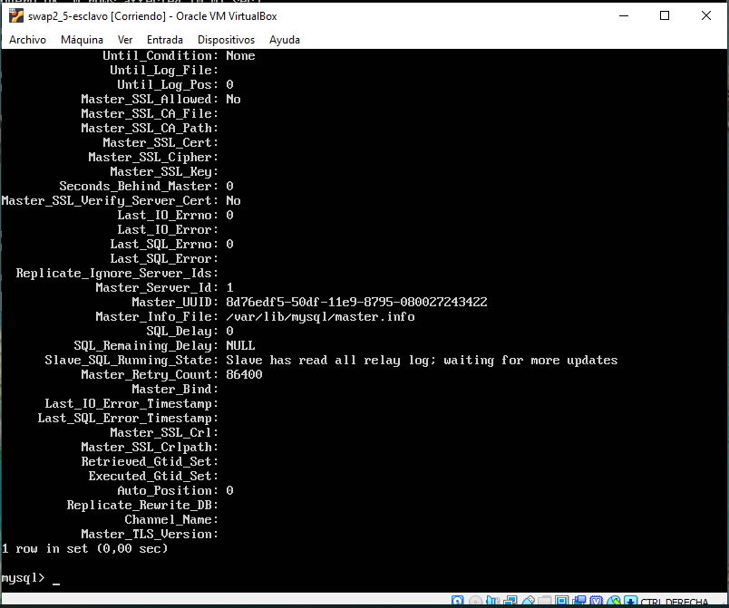

## Practica 5.
### Replicación de bases de datos - por Paula Ruiz y Manuel Ortiz.

### Crear una BD con al menos una tabla y algunos datos.

Lo primero que vamos a hacer es crear una base de datos en MySQL en la que insertaremos algunos valores, para luego poder realizar la copia de seguridad. Para ello vamos a usar la interfaz de MySQL, a la que accedemos mediante ` mysql -u root -p`.

Crearemos la base de datos _contactos_ con dos valores _nombre_ como un string y _teléfono_ como un int.

Utilizamos los siguientes comandos:

~~~
mysql> CREATE DATABASE contactos;
mysql> USE contactos;
mysql> SHOW TABLES;
mysql> CREATE TABLE datos(nombre (VARCHAR(100), tlf INT));
mysql> SHOW TABLES;
mysql> INSERT INTO datos(nombre, tlf) VALUES ("pepe", 95834987);
mysql> SELECT * FROM datos;
~~~

Y una vez que salimos, para volver a acceder a la base de datos usaremos `USE contactos;` y para mostrarla usaremos `DESCRIBE datos;`.

### Realizar la copia de seguridad de la BD en la máquina principal y copiar a la máquina secundaria.

Ahora vamos a pasar a usar la herramienta que nos ofrece MySQL para clonar las bases de datos que tenemos en nuestra maquinas, esta es __mysqldump__. Esta herramienta puede ser utilizada realizar copias de seguridad o para transferir datos de un servidor SQL a otro. El volcado contiene los comandos necesarios para crear la base de datos, las tablas y rellenarlas.

Tenemos que tener cuidado, ya que los datos de nuestra base de datos pueden estar actualizándose constantemente en el servidor principal. Por ello, antes de hacer la copia de seguridad, debemos evitar que se acceda a la base de datos. Para ello usaremos el comando `FLUSH TABLES WITH READ LOCK;`.

A continuación, vamos a realizar la copia y el desbloqueo de la base de datos, dentro nuestra maquina principal, mediante los siguientes comandos:

~~~
mysqldum contactos -u root -p > /tmp/contactos.SQL
mysql -u root -p
mysql> UNLOCK TABLES;`
~~~

Y para terminar, nos metemos en nuestra maquina secundaria y con el siguiente comando copiamos nuestra base de datos.

`scp 192.168.56.100:/tmp/contactos.sql /tmp/`

### Restaurar dicha copia de seguridad en la segunda máquina, de forma que en ambas máquinas esté esa BD de forma idéntica.

Una vez que nuestra copia de seguridad está en la segunda máquina, la que denominaremos como esclavo, ya podemos importarla.

Para poder importarla lo primero que debemos hacer será crear una base de datos (con el mismo nombre que la que hemos creado en la primera máquina para que luego podamos sincronizarla sin problemas).

Y luego, mediante `mysql -u root -p contactos < /tmp/contactos.sql` importamos la copia de seguridad de la base de datos.

### Realizar la configuración maestro-esclavo de los servidores MySQL para que la replicación de datos se realice automáticamente.

Ahora vamos a aprovechar la opción que nos da MySQL de configurar un demonio para hacer la replicación de las bases de datos sobre un __esclavo__ a partir de los datos que almacena el __maestro__.

Este proceso nos resulta más útil para acercarnos a lo que sería un entorno de producción real. Para ello deberemos configurar tanto el servidor principal como el secundario.

Por lo que partimos con que nuestra base de datos esta clonada en ambas maquinas con el mismo nombre.

Lo primero que debemos hacer es acceder a la dirección _/etc/mysql/mysql.conf.d/mysqld.cnf_ para realizar las siguientes modificaciones:

- Comentamos el parámetro `#bin-address 127.0.0.1`
- Indicamos el archivo donde se almacena el log de errores `log_error = /var/log/mysql/error.log`.
- Descomentamos y establecemos el indicador del servidor:
    - en el _maestro_ `server-id = 1`.
    - en el _esclavo_ `server-id = 2`.
- Descomentamos el registro binario que contiene la información que está en el registro de actualizaciones `log_bin = /var/log/mysql/bin.log`.

Ahora reiniciamos el servicio mediante el comando `/etc/init.d/mysql restart`.
Y si no nos ha dado ningún error nuestro demonio se habrá iniciado.

A continuación, debemos ir a nuestra maquina _maestro_ y ejecutar las siguientes sentencias para crear un usuario y darle permisos de acceso para la replicación.
~~~
mysql> CREATE USER esclavo IDENTIFIED BY 'esclavo';
mysql> GRANT REPLICATION SLAVE ON *.* TO 'esclavo'@'%' IDENTIFIED BY 'esclavo';
mysql> FLUSH PRIVILEGES;
mysql> FLUSH TABLES;
mysql> FLUSH TABLES WITH READ LOCK;
~~~

Y obtenemos los datos de la base de datos que vamos a replicar para usarlos después en la configuración del esclavo:

`mysql> SHOW MASTER STATUS;`

Volvemos a la maquina esclava y le proporcionamos los datos del maestro, para que pueda conectarse, para ello ejecutaremos la siguiente sentencia:

~~~
mysql> CHANGE MASTER TO MASTER_HOST='192.168.31.200',
MASTER_USER='esclavo',
MASTER_PASSWORD='esclavo',
MASTER_LOG_FILE='mysql-bin.000001',
MASTER_LOG_POS=980,
MASTER_PORT=3306;
~~~

Y ejecutaremos el esclavo `mysql> START SLAVE;`

Lo más importante viene ahora y es comprobar que todo funciona, cosa que comprobaremos mediante `mysql> SHOW SLAVE STATUS\G` viendo que el valor _Seconds_Behind_Master_ es distinto de _Null_.

Y por último solo queda probar que haciendo un _insert_ en el maestro, se realiza también en el esclavo.

