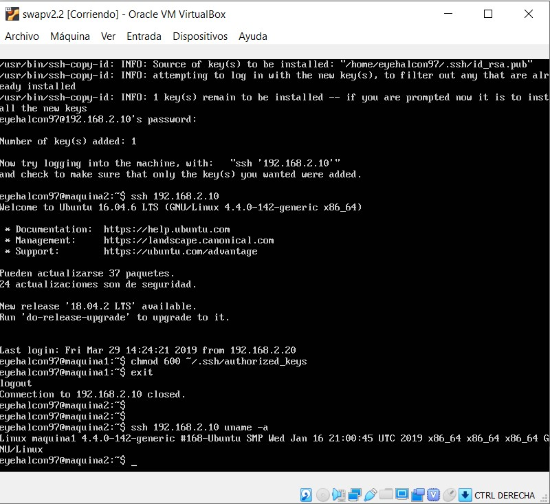
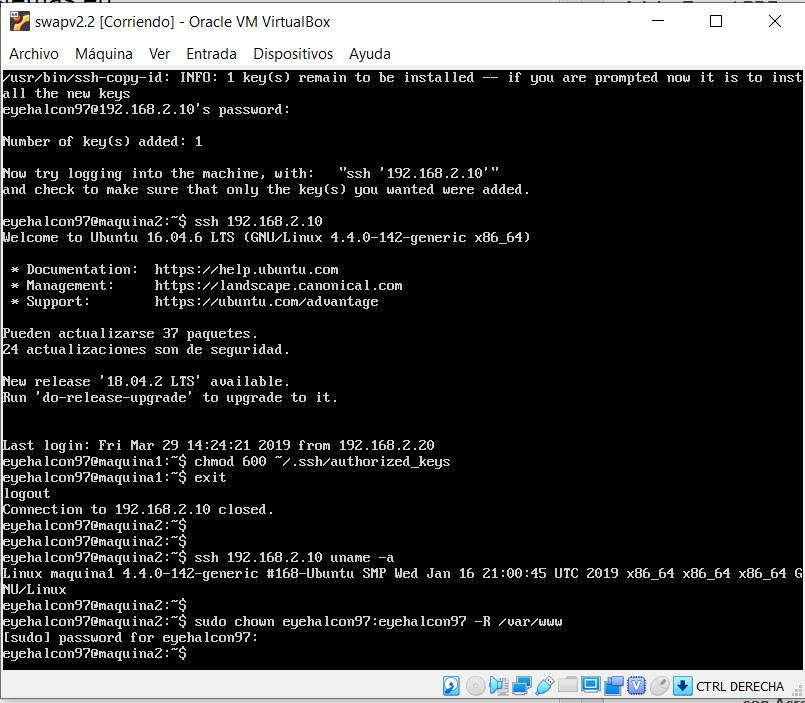
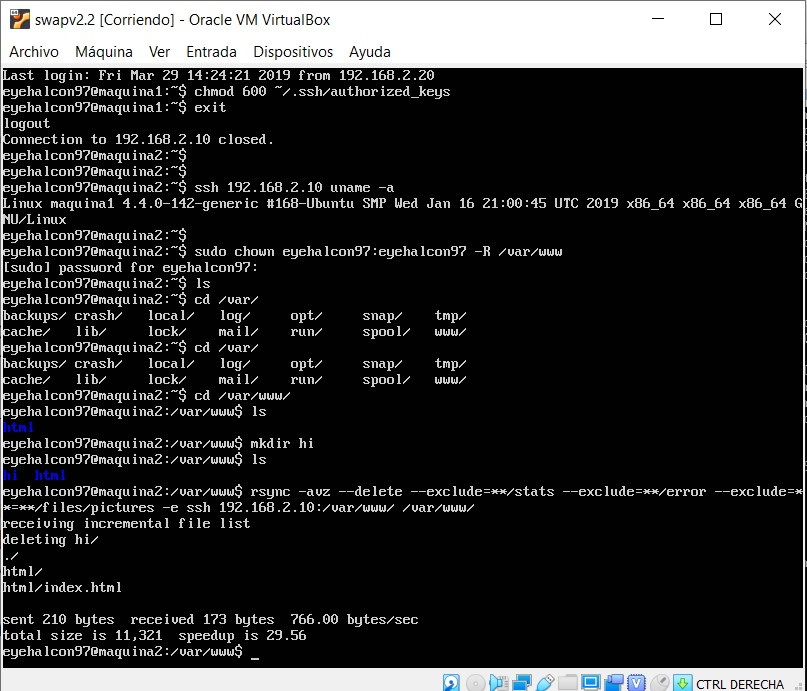
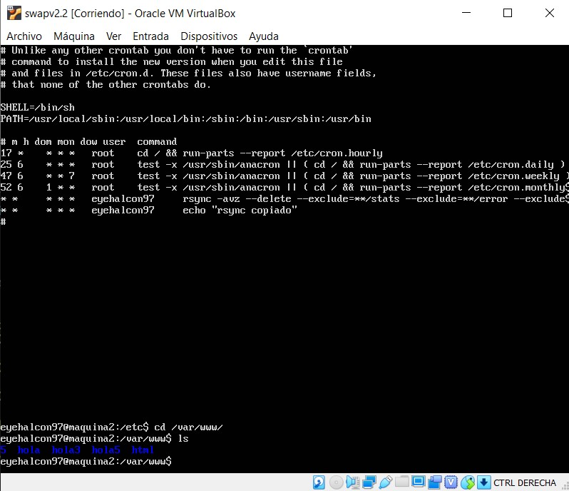

# swap1819
Practica 2:
En la segunda parte nos vamos a la maquina 2 y escribimos lo siguiente:
ssh-keygen -b 4096 -t rsa
Luego una vez creada nuestra clave privada, copiamos nuestra clave a la otra maquina a traves de ssh con:
ssh-copy-id maquina1

Despues de esto cambiamos los permisos de la carpeta en ambas maquinas para poder hacer la copia.

Una vez hecho esto ya podremos hacer rsync

Ahora procederemos a incluirlo en el crontab.

Con esto hemos acabado la practica 2.
