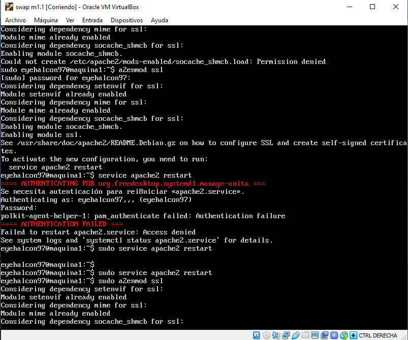
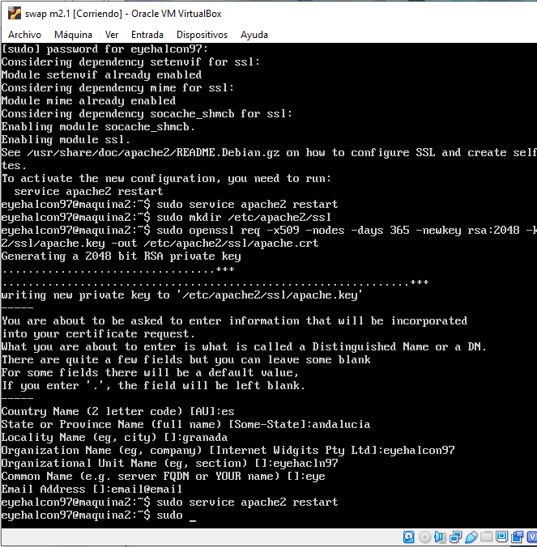
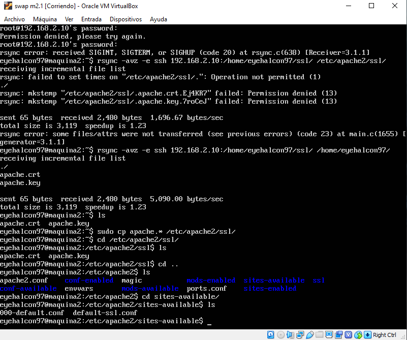
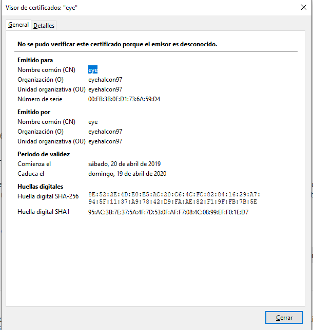
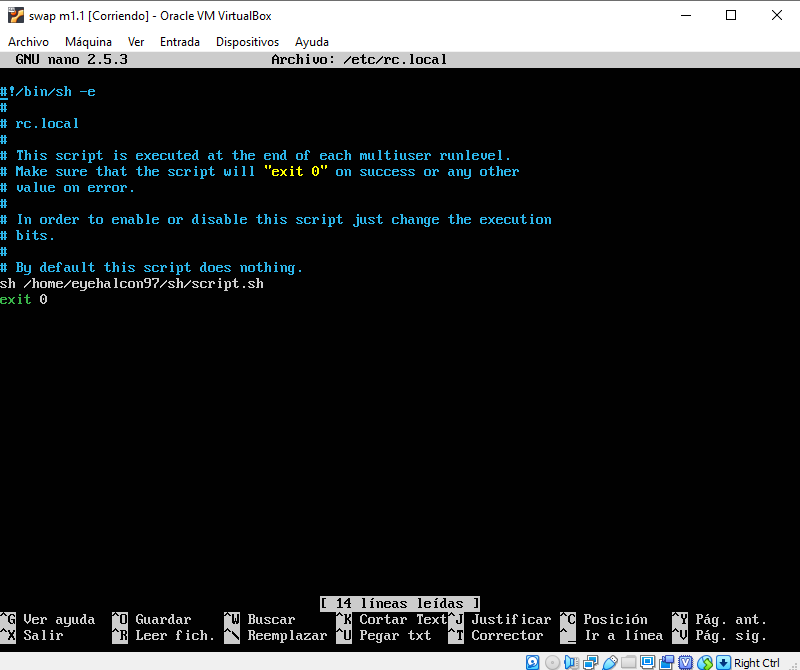

# swap1819
Practica 4:
En esta cuarta practica instalaremos un certificado en nuestros servidores finales y configuraremos nuestra maquina terminal 1 con iptables para una mayor seguridad web.
Para ello empezamos ejecutando los siguientes comando para generar nuestro propio certificado autofirmado:
a2enmod ssl
service apache2 restart
mkdir /etc/apache2/ssl
openssl req -x509 -nodes -days 365 -newkey rsa:2048 -keyout /etc/apache2/ssl/apache.key -out /etc/apache2/ssl/apache.crt

Una vez que hemos hecho esto reiniciamos nuestro servicio apache

Luego procedemos a copiarnos los archivos recien creados del certificado a nuestra segunda maquina terminal y a nuestra maquina balanceador con rsync:

Una vez copiado nuestros certificados procedemos a incluirnos en nuestra configuracion de gninx:
Para ello modificamos nuestro archivo de configuracion y quedaria tal que asi:

Una vez hecho esto podemos probarlo accediendo mediante https a nuestro servidor balanceador y el nos advertira de nuestro certificado autofirmado:

Ahora nos podremos con la configuracion de iptables, para ello nos vamos a la maquina final 1 y creamos un script que se ejecutara cada vez que se inicie dicha maquina. 
Creamos dicho script con este contenido:

Una vez hecho dicho script vamos a hacer que se ejecute cuando se encienda nuestra maquina:
Para ello modificamos el acrhivo /etc/rc.local y escribimos donde esta ubicado nuestro script:

